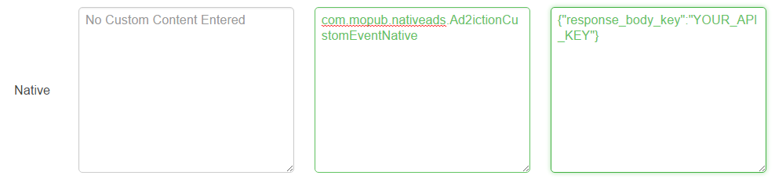

Ad2iction Android Adapter for MoPub
=================================

Adapter version 1.0.0 - Updated 2017-02-21
------------------------------------------

This version of the adapter works with MoPub Android SDK 4.12+ and Ad2iction Android SDK 3.3.0.
Otherwise, please upgrade to the newer versions of both SDKs.

###  Mediate Ad2iction Ads through MoPub

To integrate Ad2iction as the Custom Native Network in the MoPub ad serving flow, you need the
Custom Event Class code incorporated into your application in addition to the Ad2iction SDK.
Three quick steps are necessary:

1. Integrate the Ad2iction SDK and Ad2iction adapter for MoPub code into your app
2. Configure Ad2iction's Ad unit(s)
3. Configure MoPub to mediate Ad2iction

#### Integrate the Ad2iction SDK and Ad2iction adapter for MoPub code into your app

1. If your application is not yet using Ad2iction, please contact Ad2iction.

2. Add the Ad2iction Android SDK.

3. Add the Google Play Services SDK to your project. This is required for Android Advertising ID
support. See http://developer.android.com/google/playservices/setup.html.

4. Add the Ad2iction MoPub adapter classes (found in the [com.mopub.nativeads](src/com/mopub/nativeads) package) to your project. Place the following classes in the com.mopub.nativeads package:
    * [`Ad2ictionCustomEventNative`](src/com/mopub/nativeads/Ad2ictionCustomEventNative.java)
    * [`Ad2ictionNativeAdRenderer`](src/com/mopub/nativeads/Ad2ictionNativeAdRenderer.java)

5. The steps to integrate Ad2iction Native Ads via MoPub are similar to those described [here](https://github.com/mopub/mopub-android-sdk/wiki/Native-Ads-Integration):
    * Create an XML layout for your native ads
    * Define where ads should be placed within your feed
    * Create a MoPubAdAdapter to wrap your existing `Adapter` subclass and begin loading ads.
 
 And you should register the `Ad2ictionNativeAdRenderer` as a custom ad renderer.

 ```java
 ViewBinder viewBinder = new ViewBinder.Builder(R.layout.native_ad_list_item)
            // Set up your regular ViewBinder
            .build();

 // Register the Ad2ictionNativeAdRenderer to handle static native ads
 final Ad2ictionNativeAdRenderer ad2ictionRenderer = new Ad2ictionNativeAdRenderer(viewBinder);
 mAdAdapter = new MoPubAdAdapter(getActivity(), adapter);
 mAdAdapter.registerAdRenderer(ad2ictionRenderer);
 
 //...register other native ad renderers as required
 ```

6. Add permissions in AndroidManifest:
 ```xml
<uses-permission android:name="android.permission.INTERNET"/>
<uses-permission android:name="android.permission.ACCESS_COARSE_LOCATION"/>
<uses-permission android:name="android.permission.ACCESS_NETWORK_STATE"/>
<uses-permission android:name="android.permission.VIBRATE"/>
<uses-permission android:name="android.permission.WRITE_EXTERNAL_STORAGE"/>
```

7. Add Activity declaration in AndroidManifest:
 ```xml
<activity
    android:name="com.ad2iction.mobileads.Ad2ictionActivity"
    android:configChanges="keyboardHidden|orientation|screenSize"/>
<activity
    android:name="com.ad2iction.mobileads.MraidActivity"
    android:configChanges="keyboardHidden|orientation|screenSize"
    android:theme="@android:style/Theme.Translucent"/>
<activity
    android:name="com.ad2iction.common.Ad2ictionBrowser"
    android:configChanges="keyboardHidden|orientation|screenSize"/>
<activity
    android:name="com.ad2iction.mobileads.MraidVideoPlayerActivity"
    android:configChanges="keyboardHidden|orientation|screenSize"/>
```

8. If you plan to run [ProGuard](http://developer.android.com/tools/help/proguard.html) on your app
before release, you will need to add the following to your ProGuard configuration file.

 ```
# Ad2iction Proguard Config
# NOTE: You should also include the Android Proguard config found with the build tools:
# $ANDROID_HOME/tools/proguard/proguard-android.txt

# Add this line if you use Admob Adapter
-libraryjars \libs\ad2iction-mediation-adapteradmob.jar

-libraryjars \libs\ad2iction-sdk.jar

# Keep public classes and methods.
-keepclassmembers class com.ad2iction.** { public *;}
-keep public class com.ad2iction.**
-keep public class android.webkit.JavascriptInterface {}

-keep class * extends com.ad2iction.mobileads.CustomEventBanner {}
-keep class * extends com.ad2iction.mobileads.CustomEventInterstitial {}
-keep class * extends com.ad2iction.nativeads.CustomEventNative {}

-keep class com.google.android.gms.common.GooglePlayServicesUtil {*;}
-keep class com.google.android.gms.ads.identifier.AdvertisingIdClient {*;}
-keep class com.google.android.gms.ads.identifier.AdvertisingIdClient$Info {*;}
 ```

#### Configure Ad2iction Ad unit(s)

For each MoPub ad unit that you would like to mediate Ad2iction through, please contact Ad2iction.

#### Configure MoPub to mediate Ad2iction

Ad2iction's custom events are implemented in accordance with [instructions provided by MoPub](https://github.com/mopub/mopub-android-sdk/wiki/Custom-Events).

After you incorporate the Ad2iction files into your project, you need to
configure Ad2iction as a Custom Network. Please follow instructions provided by MoPub 
(for [native](https://dev.twitter.com/mopub/ui-setup/network-setup-custom-native)) with any of the Ad2iction custom events class noted below:

* [`com.mopub.nativeads.Ad2ictionCustomEventNative`](src/com/mopub/nativeads/Ad2ictionCustomEventNative.java)
 for Ad2iction native ads

**NOTE:** An important step to get this integration working is to configure the custom network (as described above) with the
Ad2iction API key and send them as server extras (in the "Custom Event Class Data" field on the MoPub UI).

The custom event class data should be in the following JSON format:

```json
{"response_body_key":"YOUR_API_KEY"}
```

You can also configure the custom event data as a line item in your MoPub order.



Changelog
---------
#### Version 1.0.0 - 2017-02-21
* Introduced Ad2iction Native Ad support in the adapter
* Supports MoPub SDK 4.12+
